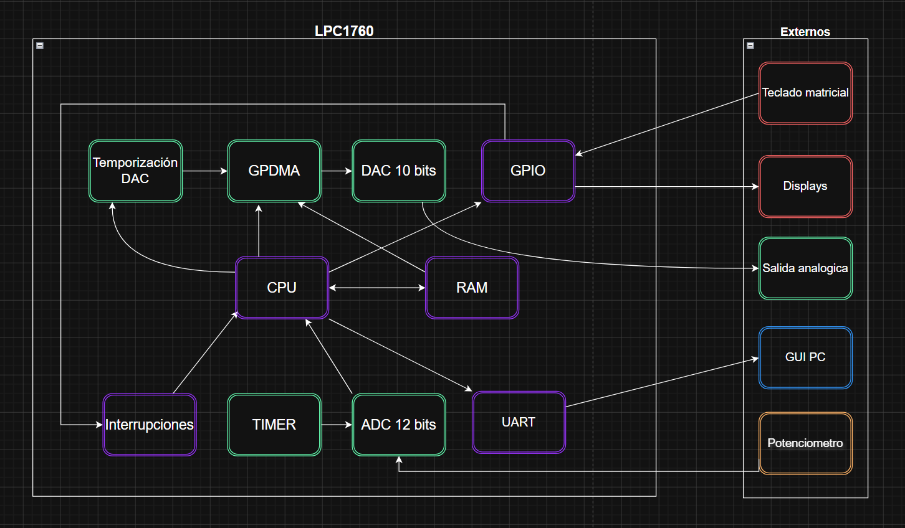
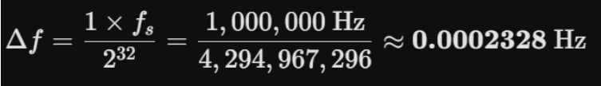
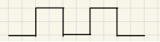
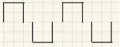
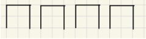
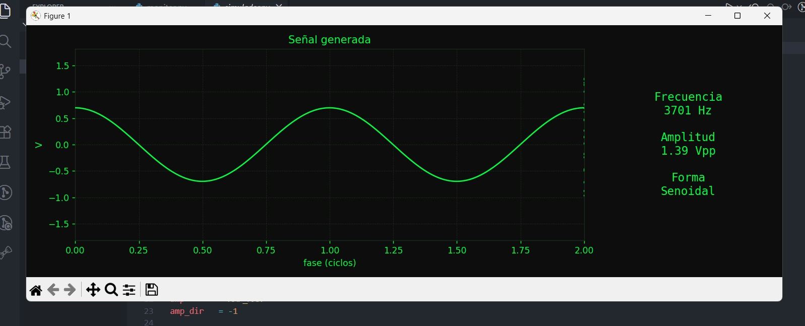

# UNIVERSIDAD NACIONAL DE CÓRDOBA
## FACULTAD DE CIENCIAS EXACTAS, FÍSICAS Y NATURALES
### CÁTEDRA DE COMPUTACIÓN — Electrónica Digital 3

**Trabajo Práctico Final: Generador de señales**


<div align="center">
</div>

**Grupo:** Signal Labs

**Integrantes:**
- Mateos Ferrero Genaro Agustín
- Flores Arnaldo Eliezer

**Profesor:** Erick

---

## Índice

1. [Portada](#portada)
2. [Resumen del proyecto](#resumen-del-proyecto)
   - Explicación breve del objetivo, problema que resuelve y resultado esperado
3. [Descripción general del sistema](#descripción-general-del-sistema)
   - Funcionamiento global
   - Entradas y salidas
   - Flujo básico de operación
4. [Arquitectura del sistema](#arquitectura-del-sistema)
   - Diagrama de módulos
5. [Configuración de periféricos del microcontrolador](#5-configuración-de-periféricos-del-microcontrolador)
6. [Funcionamiento del software](#6-funcionamiento-del-software)
   1. Estructura del programa
   2. Inicialización del sistema
   3. Lógica principal
   4. Manejo de eventos/interrupciones
   5. Algoritmos implementados
7. [Conclusiones](#conclusiones)
   1. Objetivos alcanzados
   2. Limitaciones
   3. Mejoras futuras

---

## Resumen del proyecto

En el ámbito del laboratorio de electrónica y sistemas embebidos, la generación de señales analógicas de referencia es una tarea frecuente que normalmente requiere instrumental costoso y de uso exclusivo. El presente proyecto propone una alternativa de bajo costo basada en el microcontrolador NXP LPC1769, implementando un generador digital de señales analógicas capaz de producir formas de onda senoidal, cuadrada y triangular con frecuencia y amplitud configurables en tiempo real.

El sistema se fundamenta en la técnica de síntesis digital directa (DDS), representando cada forma de onda mediante tablas de 256 muestras almacenadas en RAM. La transferencia de muestras al DAC interno de 10 bits se delega al controlador DMA mediante una estrategia de doble buffer, desacoplando completamente el timing de salida de la intervención de la CPU. El usuario dispone de dos modos de control de frecuencia, seleccionables desde el teclado matricial: ingreso directo por teclado en el rango de 1 a 9999 Hz, o ajuste analógico continuo mediante un potenciómetro conectado al ADC de 12 bits en el rango de 1 a 1000 Hz. La amplitud es ajustable digitalmente entre 0 y 3,3 V. El sistema incorpora además visualización mediante displays de siete segmentos y comunicación UART con una interfaz gráfica en PC para monitoreo remoto de parámetros.

El prototipo logra operar de forma estable integrando de manera coordinada el DAC, el DMA, los temporizadores, el ADC, el teclado matricial y la UART del LPC1769, demostrando la viabilidad de construir un instrumento de medición configurable y eficiente sobre hardware embebido.

---

## Descripción general del sistema

### Funcionamiento global

El sistema opera como un instrumento de generación de señales configurable por el usuario a través de un teclado matricial. Cuenta con dos modos de operación, seleccionables en cualquier momento con la tecla D: el **Modo 1:** la frecuencia es ingresada numéricamente por teclado, y el **Modo 2:** la frecuencia es determinada en tiempo real por el potenciómetro vía ADC.

En ambos modos, el usuario configura la forma de onda y la amplitud mediante el teclado, y controla el inicio y la detención de la generación con la tecla `*`. Los cuatro displays de siete segmentos reflejan en todo momento el estado del sistema: el dibujo de la onda durante la configuración, los dígitos ingresados durante la edición de parámetros, y la frecuencia en tiempo real durante la generación en Modo 2. Simultáneamente, el microcontrolador transmite los datos por UART a una PC, donde una interfaz gráfica los visualiza.

### Entradas y salidas

| Tipo | Elemento | Descripción |
|------|----------|-------------|
| Entrada | Teclado matricial | Selección de modo, forma de onda, ingreso de frecuencia y amplitud, Start/Stop |
| Entrada | Potenciómetro (ADC 12 bits) | Control analógico de frecuencia en rango 1–1000 Hz (solo Modo 2) |
| Salida | DAC 10 bits | Señal analógica generada, amplitud ajustable entre 0 V y 3,3 V |
| Salida | 4 displays de 7 segmentos | Visualización de forma de onda, parámetros ingresados y frecuencia en tiempo real |
| Salida | UART → PC | Transmisión de parámetros para monitoreo en interfaz gráfica |

### Flujo básico de operación

**Modo 1 — Frecuencia por teclado:**

1. El sistema arranca en Stop. El usuario selecciona la forma de onda presionando A (sinusoidal), B (cuadrada) o C (triangular); el display muestra el dibujo correspondiente. Se confirma con `#`.
2. El usuario ingresa la frecuencia deseada en Hz (1–9999) mediante dígitos y confirma con `#`.
3. El usuario ingresa la amplitud en décimas de volt (0–33, equivalente a 0–3,3 V) y confirma con `#`.
4. El usuario presiona `*` para iniciar la generación. Los displays muestran `- - - -` durante la reproducción.
5. Al presionar `*` nuevamente, el sistema se detiene y regresa al paso 1, conservando los parámetros anteriores.

**Modo 2 — Frecuencia por potenciómetro:**

1. Igual al Modo 1: selección de forma de onda con A/B/C, confirmada con `#`.
2. El usuario ingresa la amplitud y confirma con `#`. No se ingresa frecuencia.
3. Al presionar `*`, comienza la generación. Los displays muestran la frecuencia leída del potenciómetro, actualizada en tiempo real.
4. Al presionar `*` nuevamente, el sistema se detiene y regresa al paso 1.

> En cualquier momento, la tecla D permite alternar entre Modo 1 y Modo 2 sin necesidad de confirmación, conservando los parámetros de cada modo de forma independiente.

Además, siempre se pueden observar los parámetros en la interfaz gráfica de la PC.

---

## Arquitectura del sistema




El diagrama de módulos ilustra la organización interna del microcontrolador LPC1769 y su relación con los periféricos externos. A continuación se describe cada módulo:

- **CPU (ARM Cortex-M3):** núcleo central del sistema. Se encarga de la inicialización de periféricos, la lógica de control del teclado, el cálculo del paso de fase DDS, el relleno de los buffers de muestras y la gestión de la comunicación UART.
- **RAM:** almacena las tablas de 256 muestras para cada forma de onda y los dos buffers ping-pong de 64 muestras que alimentan al DMA. La CPU escribe en el buffer libre mientras el DMA lee el otro.
- **Temporización DAC:** temporizador interno configurado a 1 MHz que genera las solicitudes periódicas al GPDMA, estableciendo la frecuencia de muestreo del sistema.
- **GPDMA:** controlador de acceso directo a memoria. Transfiere las muestras desde los buffers en RAM hacia el registro del DAC de forma autónoma. Utiliza una lista enlazada circular entre los dos buffers y genera una interrupción al completar cada uno.
- **DAC:** conversor digital-analógico de 10 bits integrado en el LPC1769. Recibe las muestras del GPDMA y produce la señal analógica en la salida física del sistema.
- **Timer:** temporizador utilizado para disparar las conversiones del ADC cada 500 ms, controlando la frecuencia de muestreo del potenciómetro.
- **ADC:** conversor analógico-digital de 12 bits que muestrea la tensión del potenciómetro en Modo 2. El valor leído se mapea al rango de frecuencias 1–1000 Hz y se utiliza para actualizar el paso de fase del acumulador DDS en tiempo real.
- **Interrupciones:** gestiona las señales de interrupción generadas por el GPDMA al completar cada buffer y por el GPIO ante eventos del teclado. Notifica a la CPU para que ejecute las acciones correspondientes.
- **GPIO:** puertos de entrada/salida configurados para la lectura del teclado matricial y el control de los displays de siete segmentos multiplexados.
- **UART:** módulo de comunicación serial que transmite los parámetros activos del generador hacia la PC, donde la interfaz gráfica los recibe y visualiza.
- **Teclado matricial:** entrada externa que el usuario utiliza para seleccionar el modo de operación, la forma de onda, la frecuencia y la amplitud, y para controlar el inicio y la detención de la generación.
- **Potenciómetro:** divisor de tensión externo cuya salida alimenta el ADC. En Modo 2 actúa como control analógico continuo de la frecuencia de salida.
- **Display:** conjunto de 4 displays de siete segmentos multiplexados que muestran la forma de onda activa, los parámetros configurados y la frecuencia en tiempo real según el estado del sistema.
- **Salida analógica:** señal generada por el DAC, disponible en el pin de salida del microcontrolador.
- **GUI PC:** interfaz gráfica en la computadora que recibe los datos por UART y representa visualmente la señal y sus parámetros.

---

## 5 Configuración de periféricos del microcontrolador

### UART0

La UART0 se inicializa mediante `cfgUart()` durante el startup del sistema. Se utiliza exclusivamente para transmisión de parámetros hacia la PC; no se configura recepción.

| Parámetro | Valor |
|-----------|-------|
| Pin TX | P0.2 (función UART0) |
| Baudrate | 9600 bps |
| Bits de datos | 8 |
| Paridad | Ninguna |
| Bits de stop | 1 |
| Modo DMA | Deshabilitado |
| Modo TX | Non-blocking |

La FIFO TX se vacía durante la inicialización.

---
## 6 Funcionamiento del software

### Fundamentos de generación de ondas por tabla DDS

#### La tabla como un ciclo abstracto

Las tres formas de onda comparten la misma infraestructura porque todas responden a la misma idea: **un ciclo completo de cualquier señal periódica puede representarse con un número finito de muestras uniformemente espaciadas en el tiempo**. La tabla de 256 entradas es una discretización de un ciclo completo de lo que sea que se almacene en ella. El DDS no sabe ni le importa el contenido.

El acumulador de fase de 32 bits modela el tiempo de forma circular. Cuando llega a 2³² desborda y vuelve a 0, exactamente como un ciclo completo vuelve a su punto de inicio. Los 8 bits superiores de ese acumulador mapean ese espacio circular a los 256 índices de la tabla, y `phaseStep` controla qué tan rápido se avanza en ese círculo.

#### Onda senoidal

La tabla se construye evaluando `sin(2π × i / 256)` para `i = 0..255`. El argumento barre exactamente un ciclo completo de 0 a 2π. El resultado, que vive en `[-1, 1]`, se desplaza y escala al rango `[0, 1023]` para adaptarse al DAC de 10 bits:

```
table[i] = (sin(2π × i / 256) + 1) × 511.5
```

El `+1` elimina los negativos llevando el rango a `[0, 2]`, y el `× 511.5` lo estira a `[0, 1023]`. El punto medio queda en 511, que corresponde a Vcc/2 en la salida analógica.

La precisión de esta representación está limitada por dos factores: la resolución de 10 bits del DAC (1024 niveles) y los 256 pasos de la tabla. A frecuencias de salida bajas, cada ciclo usa muchas muestras de la tabla y la aproximación es buena. A frecuencias altas, el número de muestras por ciclo disminuye y la onda se nota más escalonada.

#### Onda cuadrada

La onda cuadrada ideal alterna entre dos estados: máximo y mínimo, con transición instantánea. Es la señal más simple de definir en una tabla porque no requiere ningún cálculo, solo una asignación directa por mitades. La primera mitad de la tabla almacena `1023` y la segunda mitad almacena `0`.

#### Onda triangular

La onda triangular es una señal de pendiente constante que sube linealmente de 0 a 1023 en la primera mitad del ciclo y baja de 1023 a 0 en la segunda mitad. La tabla se construye con interpolación lineal entera:

```
Primera mitad:  table[i] = (i × 1023) / 127         i = 0..127
Segunda mitad:  table[i] = ((255 - i) × 1023) / 127  i = 128..255
```

---

### Cálculos y fundamentos DDS

**Frecuencia y período del temporizador DMA:**

```
f_TDAC = 25 MHz  →  T_TDAC = 40 ns
```

**Frecuencia de actualización del DAC:**

```
f_DAC = 1 MHz  →  T_DAC = 1 µs
```

**Valor de recarga para el temporizador DMA:**

```
DACCNTVAL = T_act_DAC / T_TDAC - 1 = 24
```

Se utilizan **256 muestras** para obtener una definición geométrica fiel a la señal:
```
total_muestras = 256
```

Un ciclo de una onda senoidal equivale a dar una vuelta exacta a un círculo, es decir recorrer 2π radianes.
Se discretiza la circunferencia completa usando un entero de 32 bits:

- El inicio del ciclo (0 rad) es el valor `0`
- El final del ciclo (2π rad) es el valor maximo del entero: `2^32 - 1 = 4.294.967.295`
Para obtener una frecuencia de onda deseada se debe calcular el Paso de Fase(Δfase)

```
Periodo de la onda deseada:
T_onda = 1 / f_onda

Muestras por ciclo:
T_onda / T_DAC = f_DAC / f_onda

Δfase × (f_DAC / f_onda) = 2^32

Δfase = (f_onda × 2^32) / f_DAC
```
En esa cantidad de muestras, el paso de fase debe dar exactamente una vuelta completa al círculo:
```
Δfase * ( f_DAC / f_onda) = 2^32

Δfase =  (f_onda * 2^32)  /  f_DAC
```
El Acumulador de Fase es simplemente un contador que va sumando un valor estático (Δfase).
La tabla en memoria que almacena las muestras de la señal tiene 256 posiciones. Para indexar esa tabla se necesita un número de 8 bits.
Por lo que se debe hacer: acumulador >> 24 y se tienen únicamente con los 8 bits superiores.


**La resolución del generador:**

La mínima frecuencia modificable ocurre cuando Δfase = 1.




De esta forma se justifica el uso de un entero de 32 bits para discretizar la circunferencia. Se tiene gran precisión para modificar la frecuencia de la onda.

---

### Fundamento matemático de la modificación de amplitud

#### 1. La señal senoidal real

Una senoidal analógica se describe como `x(t) = A · sin(2π · f · t)`, donde A es la amplitud. Para modificarla simplemente se escala A.

#### 2. El problema en el DAC

El DAC del LPC1769 no maneja negativos, entonces la senoidal se desplaza al rango 0–1023:

```
x[n] = (sin(2π · n / 256) + 1) · 511.5
```

Esto introduce un **offset DC de 511**. La amplitud máxima es 511 (de 511 hasta 1023, y de 511 hasta 0).

#### 3. Escalar correctamente

Para escalar la amplitud sin mover el punto DC:

1. **Quitar el offset** → llevar la muestra al eje real
2. **Escalar**
3. **Devolver el offset**

Matemáticamente:
```
sample_escalada = (sample - 511) · A + 511
```

Donde A va de 0.0 a 1.0. Eso es exactamente lo que hace el código:


```c
int16_t centered = table[index] - 511;   // Paso 1: quitar offset
int16_t scaled   = centered * A;          // Paso 2: escalar
uint16_t sample  = scaled + 511;          // Paso 3: devolver offset
```

#### 4. Por qué punto fijo Q10

A es un número real entre 0.0 y 1.0, pero sin FPU los floats son costosos en tiempo real. La solución es representar A como entero multiplicado por 2¹⁰ = 1024:

```
A_real = amplitude / 1024
```
Entonces la multiplicación queda:
```
scaled = centered · amplitude / 1024 = centered · amplitude >> 10
```

#### 5. Por qué 1024 y no 1023

Para que `amplitude = 1024` represente exactamente el 100%:

```
scaled = centered · 1024 / 1024 = centered · 1.0  ✓
```

Con 1023 nunca se alcanzaría el 100% real de amplitud.

**Resumen visual:**

```
A = 1.0 (1024):  0 ───────────── 511 ───────────── 1023
A = 0.5  (512):       255 ─────── 511 ─────── 767
A = 0.0    (0):                   511                    (línea plana)
```

El punto 511 es invariante ante cualquier cambio de amplitud.

---

### Fundamentos de la modificación de frecuencia con potenciómetro

#### 1. El potenciómetro como divisor de tensión

El potenciómetro se usa como un divisor de tensión variable, con alimentación entre 0 V y 3,3 V.

#### 2. Por qué se descartan los 2 LSBs

Los bits menos significativos de un ADC son los más susceptibles al ruido, lo que hace que los LSBs oscilen aleatoriamente aunque el pot esté completamente estático. Al descartar esos 2 bits mediante un shift derecho se pasa a una resolución de 10 bits (1024 niveles), donde cada nivel representa 3,3 V / 1024 ≈ 3,2 mV. Este valor supera el nivel de ruido típico del sistema, por lo que la lectura se estabiliza sin necesidad de filtrado por software, que implicaría acumuladores, estados y latencia adicional.

#### 3. Mapeo de ADC a frecuencia

Se tiene un rango de entrada **[0, 1023]** que debe mapearse a un rango de salida **[1 Hz, 1000 Hz]**. El mapeo lineal tiene la forma general:

```
freq = freqMin + (adc10 × (freqMax - freqMin)) / adcMax
freq = 1 + (adc10 × 999) / 1023
```

#### 4. Por qué el recálculo es condicional

`calculatePhaseStep()` ejecuta una multiplicación en punto flotante emulada por software. En el LPC1769 esto implica decenas de ciclos de reloj. Ninguna operación costosa debe ejecutarse si su resultado no va a cambiar el estado del sistema.

#### 5. Coherencia con el motor DDS

El acumulador de fase no representa una frecuencia directamente sino una velocidad de avance sobre un ciclo abstracto normalizado. Cambiar `phaseStep` en cualquier momento simplemente cambia esa velocidad sin discontinuidad abrupta en la forma de onda, ya que el acumulador continúa desde donde estaba. No es necesario reinicializar buffers, tablas ni ningún otro estado.El pot modifica un único campo del struct y el efecto se propaga naturalmente en el próximo llenado de buffer.

---

### Teclado — Referencia completa

#### Teclas globales

| Tecla | Función |
|-------|---------|
| 0–9 | Ingreso de dígitos para el parámetro activo |
| `*` | Start / Stop (alterna entre ambos estados) |
| `#` | Enter — confirma y guarda el parámetro activo |
| `D` | Cambio de modo (Modo 1 ↔ Modo 2). No requiere Enter. Efecto inmediato
 |

> **Nota sobre corrección de dígitos:** No existe tecla de borrado. Si se ingresa un dígito incorrecto, se debe presionar `#` para confirmar el valor actual (aunque sea erróneo) y luego reingresar el parámetro en la siguiente edición, o bien presionar `*` (Stop) para abortar y reiniciar el flujo desde el principio.

#### Modo 1 — Generadorr onda de forma digital

**Estado general:**
- Al ingresar al modo, el sistema arranca en **Stop**.
- En estado **Start**, las teclas A, B, C y los dígitos son **ignorados**. Solo responden `*` (para detener) y `D` (cambio de modo).

**Flujo de configuración (solo disponible en Stop)**

**Paso 1 — Selección de forma de onda:**

| Tecla | Forma de onda |
|-------|---------------|
| A | Sinusoidal |
| B | Cuadrada |
| C | Triangular |

La selección requiere `#`. Si no se presiona ninguna, se conserva el valor anterior (o el valor por defecto si es la primera vez)
- Valor por defecto (primera ejecución): **Sinusoidal**.

**Paso 2 — Ingreso de frecuencia:**
- Se ingresan dígitos (0–9) que se concatenan para formar un número entero(en Hz ,desde 0 a 9999).
- Se presiona `#` para confirmar.
- Si se confirma con valor 0, es decir se avanza al siguiente paso sin modificar este campo, se conserva el valor anterior.
- Valor por defecto (primera ejecución): **60 Hz**.

**Paso 3 — Ingreso de amplitud:**
- Se ingresan dígitos que representan la amplitud en **décimas de Volt** (ej: 33 → 3,3 V).
- Se presiona `#` para confirmar.
- Si se confirma con valor 0, o se avanza sin modificar, se guarda 0 V como amplitud válida. 
- Valor por defecto (primera ejecución): **33** → 3,3 V.
- Rango válido: 1–33 (0 V a 3,3 V).

**Paso 4 — Start:** 
- Se presiona `*` para iniciar la generación con los parámetros guardados.
- La onda se reproduce de forma continua. No se admite ningún cambio de parámetros mientras el sistema está en Start.
- Durante todos los pasos anteriores (Stop), la salida del DAC está desactivada: no se produce ninguna señal analógica en el pin de salida. 

**Paso 5 — Stop:** 
- Se presiona `*` nuevamente para detener la generación. 
- El sistema vuelve al Paso 1, permitiendo modificar cualquiera de los tres parámetros.
- Los parámetros anteriores se conservan hasta que el usuario los sobreescriba con un valor válido (distinto de 0).

#### Modo 2 — Frecuencia controlada por potenciómetro

**Estado general:**
- Al ingresar al modo, el sistema arranca en **Stop**.
- En estado **Start**, las teclas ´`A`, `B`, `C` y los dígitos son **ignorados**. Solo responden * y `D`.
- La frecuencia **no se ingresa por teclado**: es leída continuamente desde la entrada analógica (potenciómetro vía ADC).

**Flujo de configuración (solo disponible en Stop)**

**Paso 1 — Selección de forma de onda** 
Idéntico al Modo 1 (`A` / `B` / `C`). Se confirma con `#`.

**Paso 2 — Ingreso de amplitud** 
Idéntico al Modo 1. Dígitos en décimas de Volt, confirmado con #. Conserva valor anterior si se ingresa `0` o se omite.

**Paso 3 — Start** 
Se presiona `*`. La frecuencia es determinada en tiempo real por el potenciómetro.

Durante todos los pasos anteriores (Stop), la salida del DAC está desactivada: no se produce ninguna señal analógica en el pin de salida. 

**Paso 4 — Stop** 
Idéntico al Modo 1. Vuelve al Paso 1 conservando los parámetros anteriores.

#### Tabla de valores por defecto  (primera ejecución)

| Parámetro | Modo 1 | Modo 2 |
|-----------|--------|--------|
| Forma de onda | Sinusoidal | Sinusoidal |
| Frecuencia | 60 Hz | — (potenciómetro) |
| Amplitud | 3,3 V | 3,3 V |

#### Resumen de comportamiento ante casos límite

| Situación | Comportamiento |
|-----------|----------------|
| Se presiona `#` con campo en 0 | Se acepta; se guarda 0 V como amplitud válida |
| Se presiona `*` (Start) antes de confirmar un campo | El campo no modificado conserva su valor anterior |
| Se presiona A/B/C estando en Start | Ignorado |
| Se presionan dígitos estando en Start | Ignorados |
| Se cambia de modo con D estando en Start | Cambia de modo; el nuevo modo arranca en Stop; **los parámetros del modo anterior se conservan** |
| Se cambia de modo con D estando en Stop | Cambia de modo; **los parámetros de ambos modos se conservan independientemente** |
| **Límite de dígitos (frecuencia y amplitud)** | El campo acepta un máximo de **4 dígitos** .Al alcanzar el 4° dígito, el campo queda **bloqueado**: los dígitos adicionales son ignorados.La única acción válida en ese momento es # para confirmar, o * para ir a Start (usando los valores ya guardados). |
| **Valor fuera de rango (amplitud > 33)** | Se descarta, se conserva el valor anterior. Si no había valor anterior (primera ejecución), se aplica el valor por defecto (3.3 V). |

---

### Máquina de estados finita del teclado.
#### Estructura de datos
El estado del sistema se representa con dos instancias de `ModeContext_t`, una por modo de operación, indexadas por `activeMode`:

c

`ModeContext_t modeCtx[2]; // [0] = Modo 1, [1] = Modo 2`

Cada instancia almacena de forma independiente la forma de onda guardada, la frecuencia (solo Modo 1), la amplitud, el paso actual del flujo de configuración, el buffer de dígitos en construcción y la cantidad de dígitos ingresados. Al cambiar de modo con la tecla D, el índice activo cambia pero ambas instancias conservan sus valores intactos.

#### Estados y transiciones
Cada modo tiene su propio flujo de pasos, que avanzan siempre en la misma dirección:

`Modo 1:  STEP_WAVEFORM → STEP_FREQUENCY → STEP_AMPLITUDE → STEP_RUNNING`

`Modo 2:  STEP_WAVEFORM → STEP_AMPLITUDE → STEP_RUNNING`

El sistema siempre vuelve a `STEP_WAVEFORM` al presionar `*` desde `STEP_RUNNING (Stop)`. No hay transiciones hacia atrás dentro de un ciclo de configuración: si el usuario quiere corregir un campo ya confirmado, debe completar el ciclo hasta Start y volver.

#### Despacho de teclas
`fsmProcessKey()` actúa como dispatcher central, una función cuyo único trabajo es **recibir algo y decidir a quién enviárselo**  .

Antes de evaluar el paso actual, verifica si la tecla es D, que tiene efecto inmediato desde cualquier estado. Si no lo es, delega en el handler del paso actual:

fsmProcessKey(key)  
  &emsp;&emsp;  │     
  &emsp;&emsp;  ├── key == KEY_D → cambio de modo inmediato   
  &emsp;&emsp;  │   
   &emsp;&emsp;  └── según ctx->step:   
    &emsp;&emsp; &emsp;&emsp;      ├── STEP_WAVEFORM  → handleWaveformStep()  
    &emsp;&emsp; &emsp;&emsp;      ├── STEP_FREQUENCY → handleFrequencyStep()   
    &emsp;&emsp; &emsp;&emsp;      ├── STEP_AMPLITUDE → handleAmplitudeStep()  
    &emsp;&emsp; &emsp;&emsp;      └── STEP_RUNNING   → handleRunningStep()  
#### Ingreso de dígitos
El ingreso numérico usa un acumulador (`inputBuffer`) que construye el valor de a un dígito por vez mediante la operación `valor = valor * 10 + dígito`. Esto permite procesar cada tecla apenas se presiona sin necesidad de esperar a que el usuario "termine" de escribir. Al confirmar con `#`, el valor acumulado se valida y, si es aceptable, reemplaza el parámetro guardado. Si el valor es `0` (campo vacío o dígito cero), el parámetro guardado se conserva sin modificar, excepto en amplitud donde 0 es un valor válido que equivale a `0` V. El campo acepta hasta 4 dígitos; al alcanzarlos queda bloqueado hasta que el usuario confirme o inicie la generación.

#### Amplitud: conversión de décimas de volt a escala Q10
La amplitud se ingresa en décimas de volt (0–33) pero se almacena en escala Q10 (0–1024) para ser compatible con el motor de generación de ondas. La conversión es:

amplitude_q10 = (tenths × 1024) / 33

Con `tenths = 33` el resultado es exactamente `1024` (escala completa, 3,3 V). Con `tenths = 0` el resultado es `0` (0 V, señal plana). La conversión se realiza una sola vez al confirmar el valor, no en cada muestra generada.

#### Control del ADC en Modo 2

El ADC y el timer del potenciómetro son habilitados por la FSM únicamente al entrar a `STEP_RUNNING` en Modo 2, y deshabilitados al salir de ese estado (Stop o cambio de modo con D). En ningún otro momento están activos. Esto garantiza que `ADC_IRQHandler` solo puede dispararse cuando el sistema está efectivamente en generación por potenciómetro.


---
### Display de 7 segmentos — Referencia completa

#### Hardware

- 4 displays de 7 segmentos multiplexados a aproximadamente **60 Hz**.
- Los displays se numeran **D1 D2 D3 D4** de izquierda a derecha.

#### Convenciones de visualización

**Alineación de números:** los dígitos se muestran alineados a la **izquierda**. Los displays sin dígito asignado permanecen **apagados**.

| Valor ingresado | D1 | D2 | D3 | D4 |
|-----------------|----|----|----|----|
| 6 | 6 | — | — | — |
| 60 | 6 | 0 | — | — |
| 600 | 6 | 0 | 0 | — |
| 6000 | 6 | 0 | 0 | 0 |

**Representación de ondas:** patrón estático fijo por tipo de onda, distribuido entre los 4 displays.

**Forma de onda**&emsp;&emsp;&emsp;&emsp;&emsp;&emsp;&emsp;**Representación**
 
Sinusoidal&emsp;&emsp;&emsp;&emsp;&emsp;&emsp;&emsp;&emsp;&emsp; curva suave:
 
&emsp;&emsp;&emsp;&emsp;&emsp;&emsp;&emsp;&emsp;&emsp;&emsp;&emsp;&emsp;&emsp;


Cuadrada&emsp;&emsp;&emsp;&emsp;&emsp;&emsp;&emsp;&emsp;&emsp; escalon:
 
&emsp;&emsp;&emsp;&emsp;&emsp;&emsp;&emsp;&emsp;&emsp;&emsp;&emsp;&emsp;&emsp;


Trinagular&emsp;&emsp;&emsp;&emsp;&emsp;&emsp;&emsp;&emsp;&emsp; dientes:
 
&emsp;&emsp;&emsp;&emsp;&emsp;&emsp;&emsp;&emsp;&emsp;&emsp;&emsp;&emsp;&emsp;

Son representaciones simbólicas fijas, no animadas.

#### Modo 1 — Frecuencia fija por teclado

**Paso 1 — Selección de forma de onda:**
- Al presionar `A`, `B` o `C` se muestra inmediatamente el **dibujo de la onda** correspondiente.
- El dibujo permanece visible hasta confirmar con `#`(Enter).
- Si no se presionó ninguna tecla de onda aún, se muestra el dibujo de la onda actualmente guardada (por defecto: sinusoidal).

**Paso 2 — Ingreso de frecuencia:**
- Al confirmar la onda con #, los displays pasan a mostrar el campo de frecuencia.
- Sin dígito ingresado, se muestra **0** en D1 (resto apagado).
- A medida que el usuario ingresa dígitos, se muestran alineados a la izquierda en tiempo real.
- Al presionar `#`, el valor se guarda y se avanza al siguiente paso.

**Paso 3 — Ingreso de amplitud:** 
- Idéntico al paso de frecuencia: sin dígito ingresado se muestra 0, los dígitos se van mostrando alineados a la izquierda.
- Al presionar `#`, el valor se guarda

**Paso 4 — Start(*):** 
- Los 4 displays muestran **`- - - -`** (cuatro guiones)
- No se muestra ningún parámetro.
- No se admite ninguna entrada de parámetros.

**Paso 5 — Stop(*):** 
- El sistema vuelve al Paso 1.
- Se muestra el dibujo de la onda actualmente guardada.
- Los campos de frecuencia y amplitud muestran `0` si el usuario aún no ingresó dígitos en este ciclo (el valor guardado se conserva internamente, pero el display arranca en `0` para indicar que el campo está listo para ser editado).


#### Modo 2 — Frecuencia controlada por potenciómetro

**Paso 1 — Selección de forma de onda**
Idéntico al Modo 1: se muestra el dibujo de la onda al presionar `A`/`B`/`C`, confirmado con `#`.

**Paso 2:** 
Idéntico al paso de amplitud del Modo 1. No existe paso de frecuencia.


**Paso 3 — Start(*):** 
- Los displays muestran la **frecuencia actual** leída del potenciómetro, actualizada en tiempo real.
- Solo se muestran los dígitos significativos, alineados a la izquierda (el resto apagado).
- Ejemplo: 60 Hz → 6 0 — —; 1000 Hz → 1 0 0 0.


**Paso 4 — Stop(*):** 
- Idéntico al Modo 1: vuelve al Paso 1, muestra el dibujo de la onda guardada, campos listos para editar mostrando 0.


#### Tabla resumen por estado y modo

| Estado | Modo 1 | Modo 2 |
|--------|--------|--------|
| Stop — selección de onda | Dibujo de la onda seleccionada | Dibujo de la onda seleccionada |
| Stop — ingreso de frecuencia | Dígitos alineados a la izquierda (o 0) | — (no aplica) |
| Stop — ingreso de amplitud | Dígitos alineados a la izquierda (o 0) | Dígitos alineados a la izquierda (o 0) |
| Start | `- - - -` | Frecuencia actual del potenciómetro |

#### Casos límite

| Situación | Comportamiento en display |
|-----------|--------------------------|
| Se cambia de modo con D | El display actualiza inmediatamente al estado correspondiente del nuevo modo |
| Se presiona `*`(Start) sin haber ingresado dígitos | Se pasa a Start con el valor guardado; el display muestra **- - - -** (Modo 1) o frecuencia del potenciómetro (Modo 2) |
| Frecuencia del potenciómetro supera 4 dígitos | No ocurre el potenciómetro está mapeado con un límite superior de 9999 Hz |
| Se presiona `#` con 0 en pantalla | El valor no se guarda; el display vuelve a mostrar 0 para indicar campo vacio|


---

### Comunicación UART y monitoreo en PC

#### Protocolo serie

El microcontrolador transmite los parámetros activos del generador mediante un paquete fijo de 7 bytes cada vez que el sistema está en estado `STEP_RUNNING`. La función responsable es `UART_SendWaveParams()`, definida en `cfg_uart.c`.

| Byte | Contenido |
|------|-----------|
| 0 | `0xAA` — delimitador de inicio |
| 1 | Frecuencia MSB |
| 2 | Frecuencia LSB |
| 3 | Amplitud MSB (escala Q10, rango 0–1024) |
| 4 | Amplitud LSB (escala Q10, rango 0–1024) |
| 5 | Tipo de onda: `0` = senoidal, `1` = cuadrada, `2` = triangular |
| 6 | `0xFF` — delimitador de fin |

El receptor sincroniza en el byte `0xAA` antes de leer el resto del paquete, lo que permite realinearse automáticamente ante tramas corruptas o parciales.

#### Interfaz gráfica (`monitor.py`)

Script Python que recibe los paquetes por puerto serie y visualiza la señal en tiempo real mediante matplotlib. Opera en dos hilos: un hilo de fondo lee el puerto serie y actualiza el estado compartido con `threading.Lock`, mientras el hilo principal ejecuta la animación a ~30 fps (`interval=33 ms`).

La amplitud recibida en escala Q10 se convierte a voltios pico para escalar el gráfico:

```
amp_Vpp  = (amplitude / 1024) × VCC
amp_peak = amp_Vpp / 2
```

La velocidad de scroll de la onda se mapea logarítmicamente sobre el rango de frecuencias (1–9999 Hz), de modo que la visualización resulte estable tanto a frecuencias bajas como altas.

**Uso:**

```bash
pip install pyserial matplotlib numpy
# Ajustar PORT en el script según el puerto COM asignado al LPC1769
python monitor.py
```


#### Simulador (`simulador.py`)

Script auxiliar para desarrollo y pruebas sin hardware. Genera paquetes válidos del mismo formato que el LPC1769, enviando frecuencia y amplitud que oscilan en forma de triángulo (bounce) entre sus valores mínimo y máximo. La forma de onda avanza al siguiente tipo cada vez que la frecuencia alcanza el mínimo, recorriendo el ciclo senoidal → cuadrada → triangular indefinidamente.

Permite verificar el comportamiento completo de `monitor.py` de forma independiente del microcontrolador.

**Uso:**

```bash
# Conectar simulador.py a un puerto COM virtual emparejado con monitor.py
# Ajustar PORT en el script según corresponda
python simulador.py
```

---

## Conclusiones


### Objetivos alcanzados

### Limitaciones

### Mejoras futuras